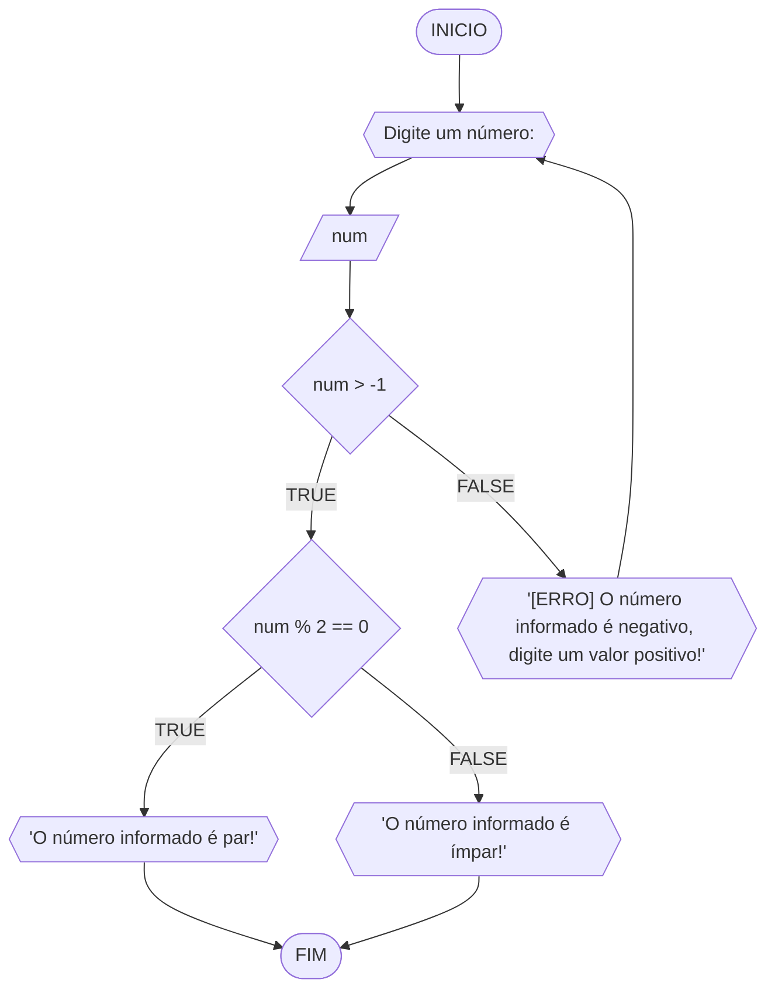
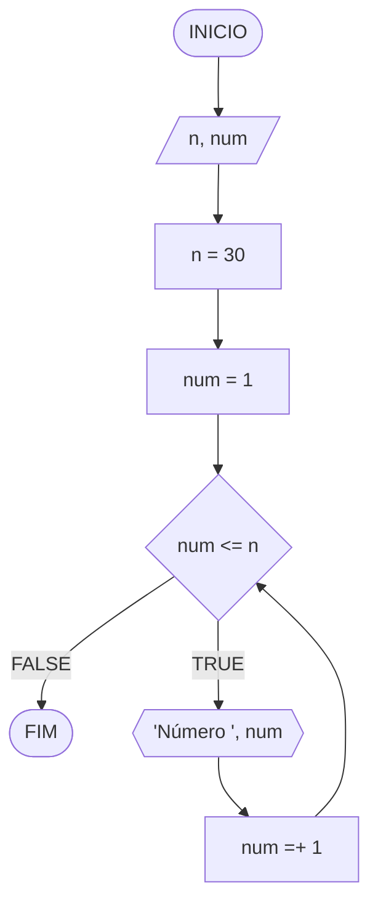
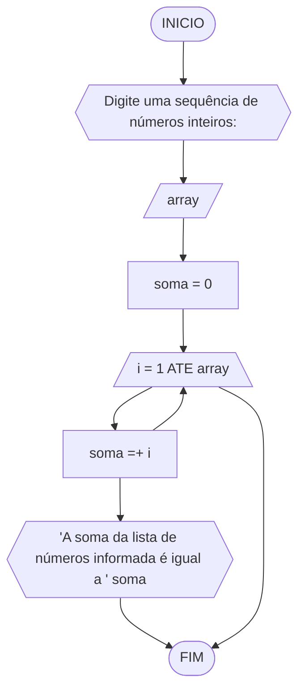

**Disciplina:** Raciocínio Lógico Algorítmico
**Orientador:** Prof. Ricardo Carubbi
## Lista exercícios - Estruturas de Repetição

1) Atualize o algoritmo para determinar se um número inteiro e positivo é par ou ímpar, usando uma laço condicional para aceitar apenas números maiores ou iguais a zero.

### Fluxograma


### Pseudocódigo
```
1)	ALGORITMO par_impar
2)	DECLARE num: INTEIRO
3)	INICIO
4)	ESCREVA 'Digite um número: '
5)	LEIA num
6)	SE num < 0 ENTAO
7)		REPITA
8)			ESCREVA '[ERRO] O número informado é negativo, digite um valor positivo: '
9)			LEIA num
10)		ATE_QUE num > -1
11)	FIM_SE
12)	SE num % 2 == 0 ENTAO
13)		ESCREVA 'O número informado é par!'
14)	SENAO 
15)		ESCREVA 'O número informado é ímpar!'
16)	FIM_ALGORITMO
```

### Teste de Mesa

| num | num > -1 | num % 2 == 0 | Saída
|--- |--- |--- |--- |
| -1 | false |  | '[ERRO] O número informado é negativo, digite um valor positivo: ' |
| 0 | true | true | 'O número informado é par!' |
| 1 | true | false | 'O número informado é ímpar!'|
| 2 | true | true | 'O número informado é par!'

2) Faça um algoritmo que exiba na tela uma contagem de 0 até 30, exibindo apenas os múltiplos de 3.

### Fluxograma


### Pseudocódigo
```
1)	ALGORITMO contagem_1_a_30
2)	DECLARE n, num: INTEIRO
3)	INICIO
4)	n <- 30
5)	num <- 1
6)	ENQUANTO num <= n FAÇA
7)		ESCREVA “Número ”, num
8)		num ← num + 1
9)	FIM_ENQUANTO
10)	FIM
```

### Teste de Mesa
| it | n | num | num <= n | Saída | num =+ 1 |
|--- |--- |--- |--- |--- |--- |
| 1º | 30 | 1 | true | Número 1 | 2 |
| 2º | 30 | 2 | true | Número 2 | 3 |
| 3º | 30 | 3 | true | Número 3 | 4 |
| ... | ... | ... | ... | ... | ... |
| 30º | 30 | 30 | true | Número 30 | 31 |
| 31º | 30 | 31 | false |  |  |

3) Dada uma sequência de números inteiros, calcular a sua soma. Por exemplo, para a sequência {12, 17, 4, -6, 8, 0}, o seu programa deve escrever o número 35. 

### Fluxograma

### Pseudocódigo
```
1)	ALGORITMO soma_numeros
2)	DECLARE array, soma: INTEIRO
3)	INICIO
4)	ESCREVA 'Digite uma sequência de números inteiros: '
5)	LEIA array
6)	soma <- 0
7)	PARA i DE 1 ATÉ array FAÇA
8)		soma ← soma + i
9)	FIM_PARA
10)	ESCREVA “A soma da lista de números informada é igual a ”, soma
11)	FIM
```

### Teste de Mesa
| it | array | soma | i | soma =+ 1 |
|--- |--- |--- |--- |--- |
| 1º | {12, 17, 4, -6, 8, 0} | 0 | 12 | 12 |
| 2º | {12, 17, 4, -6, 8, 0} | 12 | 17 | 29 |
| 3º | {12, 17, 4, -6, 8, 0} | 29 | 4 | 33 |
| 4º | {12, 17, 4, -6, 8, 0} | 33 | -6 | 27 |
| 5º | {12, 17, 4, -6, 8, 0} | 27 | 8 | 35 |
| 6º | {12, 17, 4, -6, 8, 0} | 35 | 0 | 35 |

4) Escreva um programa que leia a nota de diversos alunos, até que seja digitada uma nota negativa. Nesse momento, ele mostra a média aritmética de todas as notas lidas e quantas notas foram lidas. Ex. Foram lidas 14 notas. A média aritmética é 6.75!

### Fluxograma
```mermaid
flowchart TD

```
