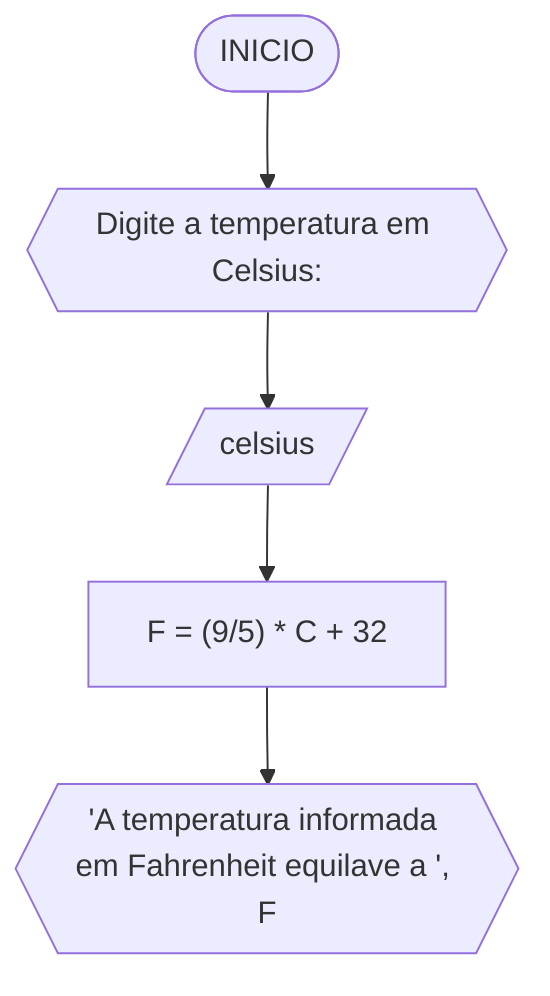

**Disciplina:** Raciocínio Lógico Algorítmico
**Orientador:** Prof. Ricardo Carubbi
## Lista exercícios
1) Calcule a média de quatro números inteiros dados. 
#### Fluxograma

#### Pseudocódigo
```
1)	ALGORITMO calc_media
2)	DECLARE valor1: inteiro,
3)			valor2: inteiro,
4)			valor3: inteiro,
5)			valor4: inteiro
6)			media
7)	INICIO
8)	ESCREVA "Digite O valor 1: "
9)	LEIA valor1
10)	ESCREVA "Digite O valor 2: "
11)	LEIA valor2
12)	ESCREVA "Digite O valor 3: "
13)	LEIA valor3
14)	ESCREVA "Digite O valor 4: "
15)	LEIA valor4
16)	media -> (valor1 + valor2 + valor3 + valor4) / 4
17)	ESCREVA 'A média dos números informados é ', media
18)	FIM
```
| Header | Another header | Yet another header |
|--- |--- |--- |
| row 1 | column 2 | column 3 |
| row 2 | row 2 column 2 | row 2 column 3 |

2) Leia uma temperatura dada na escala Celsius (C) e imprima o equivalente em Fahrenheit (F). (Fórmula de conversão: F = (9/5) * C + 32) 
#### Fluxograma

3) Leia uma quantidade de chuva dada em polegadas e imprima o equivalente em milímetros (25,4 mm = 1 polegada). 
#### Fluxograma
```mermaid

```
4) O custo ao consumidor de um carro novo é a soma do custo de fábrica com a porcentagem do distribuidor e dos impostos, ambos aplicados ao custo de fábrica. Supondo que a porcentagem do distribuidor seja de 12% e a dos impostos de 45%, prepare um algoritmo para ler o custo de fábrica do carro e imprimir o custo ao consumidor.
#### Fluxograma
```mermaid

```
