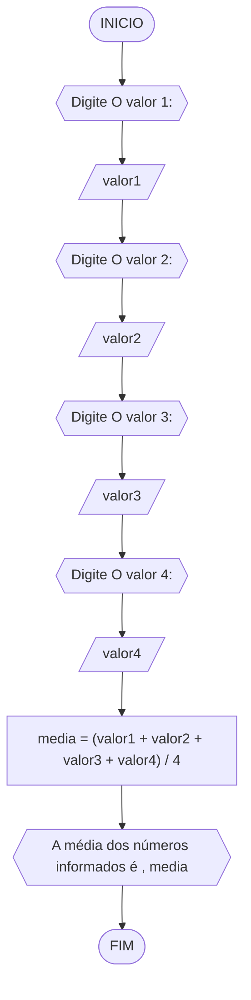
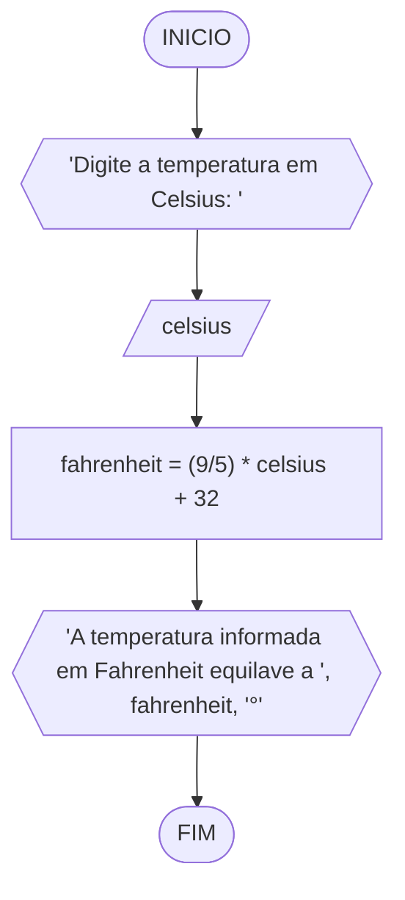
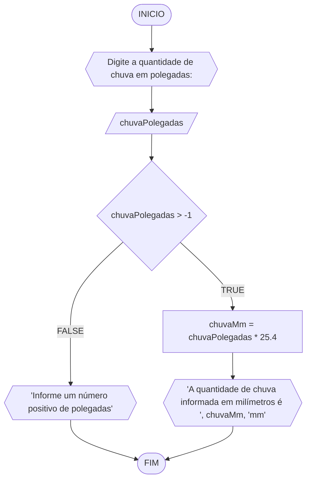
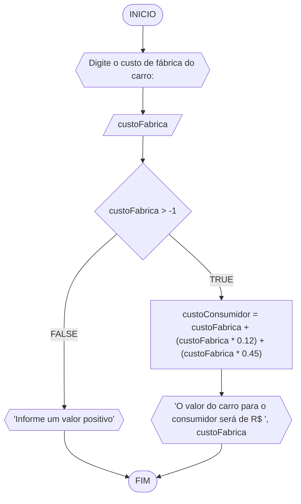

**Disciplina:** Raciocínio Lógico Algorítmico
**Orientador:** Prof. Ricardo Carubbi
## Lista exercícios
1) Calcule a média de quatro números inteiros dados. 
#### Fluxograma

#### Pseudocódigo
```
1)	ALGORITMO calc_media
2)	DECLARE valor1, valor2, valor3, valor4: INTEIRO
3)			media
4)	INICIO
5)	ESCREVA "Digite O valor 1: "
6)	LEIA valor1
7)	ESCREVA "Digite O valor 2: "
8)	LEIA valor2
9)	ESCREVA "Digite O valor 3: "
10)	LEIA valor3
11)	ESCREVA "Digite O valor 4: "
12)	LEIA valor4
13)	media -> (valor1 + valor2 + valor3 + valor4) / 4
14)	ESCREVA 'A média dos números informados é ', media
15)	FIM
```
#### Tabela Teste
| valor1 | valor2 | valor3 | valor4  | media | Saída
|--- |--- |--- |--- |--- |--- |
| -3 | -2 | -6 | -6 | -4.25 | 'A média dos números informados é -4.25' |
| -2 | 45 | 790 | -65 | 192 | 'A média dos números informados é 192' |
| 56 | 89 | 54 | 0 | 49.75 | 'A média dos números informados é 49.75'

2) Leia uma temperatura dada na escala Celsius (C) e imprima o equivalente em Fahrenheit (F). (Fórmula de conversão: F = (9/5) * C + 32) 
#### Fluxograma

#### Pseudocódigo
```
1)	ALGORITMO conversor_temperatura
2)	DECLARE celsius, fahrenheit: FLOAT
3)	INICIO
4)	ESCREVA 'Digite a temperatura em Celsius: '
5)	LEIA celsius
6)	fahrenheit -> (9/5) * celsius + 32
7)	ESCREVA 'A temperatura informada em Fahrenheit equilave a ', fahrenheit, '°'
8)	FIM
```
#### Tabela Teste
| celsius | fahrenheit | Saída |
|--- |--- |--- |
| -3 | 26.6 | 'A temperatura informada em Fahrenheit equilave a 26.6°' |
| 0 | 32 | 'A temperatura informada em Fahrenheit equilave a 32°' |
| 56.95 | 89 | 'A temperatura informada em Fahrenheit equilave a 134.51°' |

3) Leia uma quantidade de chuva dada em polegadas e imprima o equivalente em milímetros (25,4 mm = 1 polegada). 
#### Fluxograma

#### Pseudocódigo
```
1)	ALGORITMO conversor_chuva
2)	DECLARE chuvaPolegada: INTEIRO,
3)			chuvaMm: FLOAT
4)	INICIO
5)	ESCREVA 'Digite a quantidade de chuva em polegadas: '
6)	LEIA chuvaPolegada
7)	SE chuvaPolegada > -1 ENTAO
8)		chuvaMm = chuvaPolegadas * 25.4
9)		ESCREVA 'A quantidade de chuva informada em milímetros é', chuvaMm, 'mm'
10)	SENAO 
11)	ESCREVA 'Informe um número positivo de polegadas'
12) FIM_SE
13)	FIM
```
#### Tabela Teste
| chuvaPolegada | chuvaPolegada > -1 | chuvaMm | Saída |
|--- |--- |--- |--- |
| -20 | false |  | 'Informe um número positivo de polegadas' |
| 0 | true | 0 | 'A quantidade de chuva informada em milímetros é 0mm' |
| 24 | true | 609.6 | 'A quantidade de chuva informada em milímetros é 609.6mm' |

4) O custo ao consumidor de um carro novo é a soma do custo de fábrica com a porcentagem do distribuidor e dos impostos, ambos aplicados ao custo de fábrica. Supondo que a porcentagem do distribuidor seja de 12% e a dos impostos de 45%, prepare um algoritmo para ler o custo de fábrica do carro e imprimir o custo ao consumidor.
#### Fluxograma

#### Pseudocódigo
```
1)	ALGORITMO conversor_custo_consumidor
2)	DECLARE custoFabrica, custoConsumidor: FLOAT
3)	INICIO
4)	ESCREVA 'Digite o custo de fábrica do carro: '
5)	LEIA custoFabrica
6)	SE custoFabrica > -1 ENTAO
7)		custoConsumidor = custoFabrica + (custoFabrica * 0.12) + (custoFabrica * 0.45)
8)		ESCREVA 'O valor do carro para o consumidor será de R$ ', custoFabrica
9)	SENAO 
10)	ESCREVA 'Informe um valor positivo'
11) FIM_SE
12)	FIM
```
#### Tabela Teste
| custoFabrica | custoFabrica > -1 | custoConsumidor | Saída |
|--- |--- |--- |--- |
| -2000000 | false |  | 'Informe um valor positivo' |
| 0 | true | 0 | 'O valor do carro para o consumidor será de R$ 0'| |
| 3500000 | true | 5495000 | 'O valor do carro para o consumidor será de R$ 5495000' |
