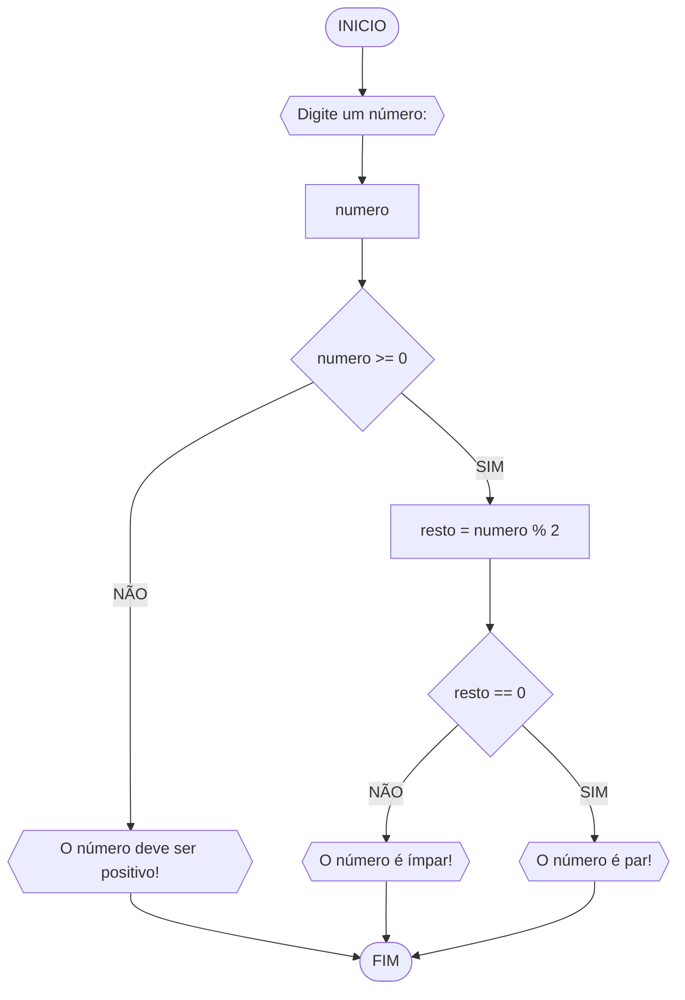
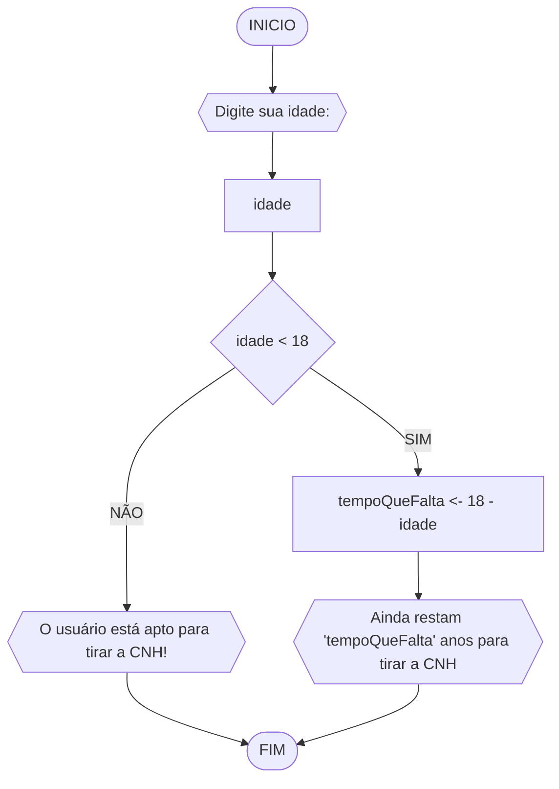

**Disciplina:** Raciocínio Lógico Algorítmico
**Orientador:** Prof. Ricardo Carubbi
## Lista exercícios
### Exercício 3
3) Represente, em fluxograma e pseudocódigo, um algoritmo para determinar se um ==número inteiro e positivo é par ou ímpar==.
#### Fluxograma

#### Pseudocódigo
```
1	ALGORITMO verifica_par_impar
2	DECLARE numero, resto NUMERICO
3	ESCREVA "Digite o número: "
4	LEIA numero
5	SE numero >= 0 ENTAO
6		resto <- numero % 2
7		SE resto == 0 ENTAO
8			ESCREVA "O número é par"
9		SENAO
10			ESCREVA "O número é ímpar"
11	SENAO
12		ESCREVA "O número deve ser positivo"
13	FIM_ALGORITMO
```
### Exercício 4
4) Represente, em fluxograma e pseudocódigo, um algoritmo que, a partir da ==idade do
candidato(a)==, determinar se ==pode ou não tirar a CNH==. Caso não atender a restrição de idade, calcular ==quantos anos faltam== para o candidato estar apto.
#### Fluxograma

#### Pseudocódigo
```
1	ALGORITMO verifica_idade_CNH
2	DECLARE idade, tempoQueFalta NUMERICO
3	ESCREVA "Digite sua idade: "
4	LEIA idade
5	SE idade < 18 ENTAO
6		tempoQueFalta <- 18 - idade
7		ESCREVA "Ainda restam 'tempoQueFalta' anos para tirar a CNH"
8	SENAO
9		ESCREVA "O usuário está apto para tirar a CNH!"
10	FIM_ALGORITMO
```
