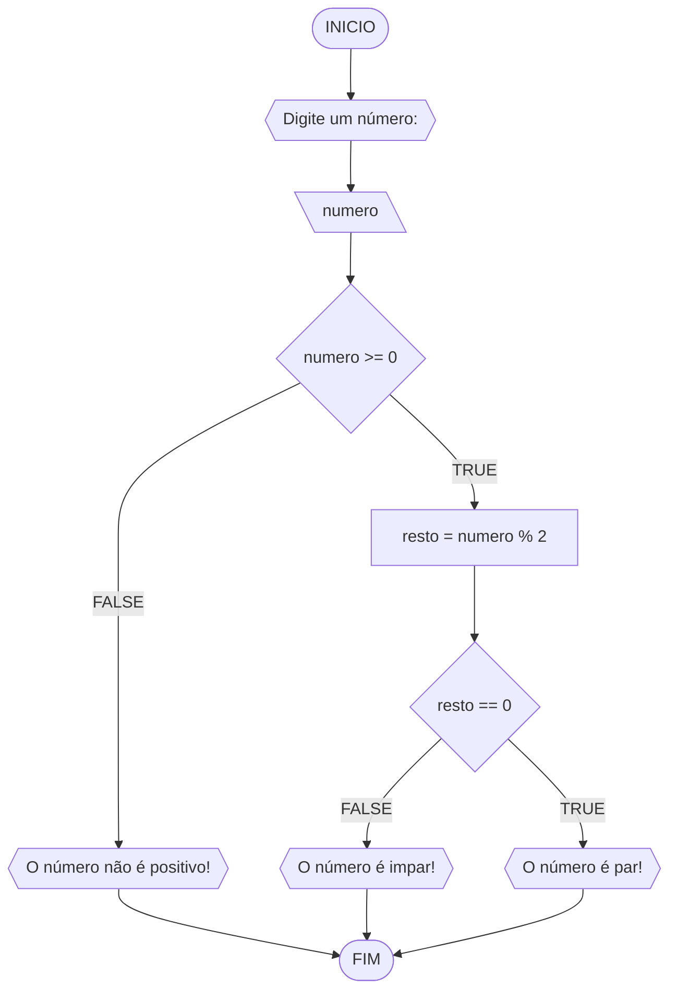
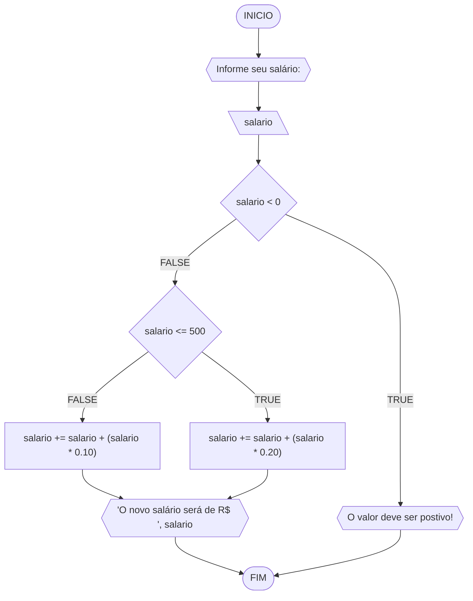
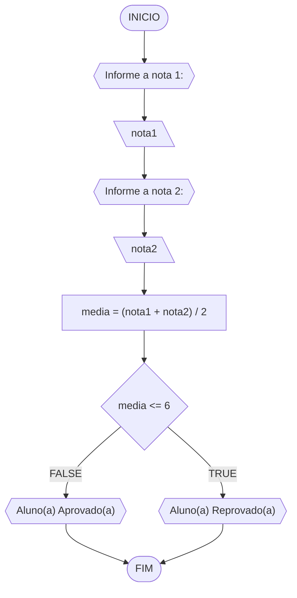
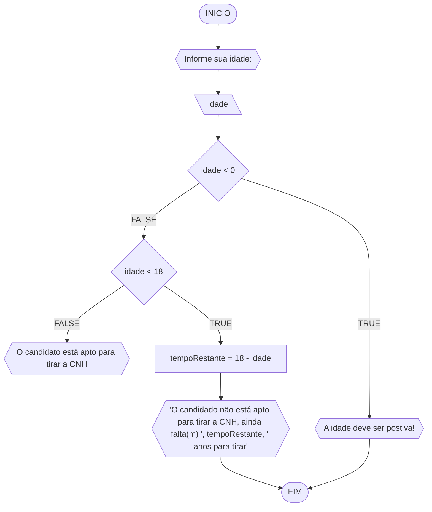

# UNIFOR
**Nome**: Maria Júlia Soares Siqueira Melo <br>
**Disciplina**: Raciocínio lógico algorítmico

## Lista de exercícios 01

### Exercício 01 (1 ponto)
Represente, em fluxograma e pseudocódigo, um algoritmo para determinar se um número inteiro e positivo é par ou impar.

#### Fluxograma (0,25 ponto)



#### Pseudocódigo (0,5 ponto)
```
1  ALGORTIMO verifica_par_impar
2  DECLARE numero, resto: INTEIRO
3  INICIO
4  ESCREVA "Digite um número: "
4  LEIA numero
5  SE numero >= 0 ENTAO                  
6    resto = numero % 2                 
7    SE resto == 0 ENTAO                
8      ESCREVA "O número informado é par!"
9    SENAO
10     ESCREVA "O número informado é impar!"
11   FIM_SE
11  SENAO                                
12    ESCREVA "O número deve ser postivo!"
13  FIM_SE
13	FIM_ALGORITMO
```

#### Teste de mesa (0,25 ponto)
| numero | numero >= 0 | resto | resto == 0 | Saída |
| -- | -- | -- | -- | -- | 
| -1 | F |   |   | "O número deve ser postivo!" |
| 0  | V | 0 | V | "O número informado é par!" |
| 13 | V | 1 | F | "O número informado é impar!" |
| 30 | V | 0 | V | "O número informado é par!" |

## Exercício 02 (3 pontos)
Represente, em fluxograma e pseudocódigo, um algoritmo para calcular o novo salário de um funcionário. 
Sabe-se que os funcionários que recebem atualmente salário de até R$ 500 terão aumento de 20%; os demais terão aumento de 10%.

#### Fluxograma (1.0 ponto)


#### Pseudocódigo (1.0 ponto)

```
Algoritmo novo_salario
1	DECLARE salario: FLOAT
2	INICIO
3	ESCREVA: "Informe seu salário: "
4	LEIA salario 
5	SE salario < 0 ENTAO
6		ESCREVA "O valor deve ser postivo!"
7	SENAO
8		SE salario <= 500 ENTAO
9			salario += salario + (salario * 0.20)
10			ESCREVA 'O novo salário será de R$ ', salario
11		SENAO
12			salario += salario + (salario * 0.10)
13			ESCREVA 'O novo salário será de R$ ', salario
14		FIM_SE
15	FIM_SE
16	FIM_ALGORITMO
```
#### Teste de mesa (1.0 ponto)

| salario | salario < 0 | salario <= 500 | Saída | 
|      --      |      --      |      --      |      --      |    
| 250 | F | V | 'O novo salário será de R$ 300' |
| 500 | F | V | 'O novo salário será de R$ 600' |
| 732.89 | F | F | 'O novo salário será de R$ 806.179' |
| 1250 | F | F | 'O novo salário será de R$ 1375' |
| -300 | V |  | "O valor deve ser postivo!" |
| -300.65 | V |  | "O valor deve ser postivo!" |

## Exercício 03 (3 pontos)
Represente, em fluxograma e pseudocódigo, um algoritmo para calcular a média aritmética entre duas notas de um aluno e mostrar sua situação, que pode ser aprovado ou reprovado.

#### Fluxograma (1 ponto)



#### Pseudocódigo (1 ponto)

```
Algoritmo media_notas
1	DECLARE nota1, nota2, media: FLOAT
2	INICIO
3	ESCREVA "Informe a nota 1: "
4	LEIA nota1
5	ESCREVA "Informe a nota 2: "
6	LEIA nota2
7	media = (nota1 + nota2) / 2
8	SE media <= 6 ENTAO
9		ESCREVA "Aluno(a) Reprovado(a)"
10	SENAO
11		ESCREVA "Aluno(a) Aprovado(a)"
12	FIM_ALGORITMO
```

#### Teste de mesa (1 ponto)

| nota1 | nota2 | media | media <= 6 | Saída | 
|      --      |      --      |      --      |      --      |      --      | 
| 8 | 10 | 9 | F | "Aluno(a) Aprovado(a)" |
| 3 | 4 | 3.5 | V | "Aluno(a) Reprovado(a)" |
| 5.6 | 4,9 | 5.25 | V | "Aluno(a) Reprovado(a)" |
| -3.5 | 5.2 | 0.85 | V | "Aluno(a) Reprovado(a)" |
| 10 | 5.75 | 7.89 | F | "Aluno(a) Aprovado(a)" |

## Exercício 04 (3 pontos)
Represente, em fluxograma e pseudocódigo, um algoritmo que, a partir da idade do candidato(a), determinar se pode ou não tirar a CNH. 
Caso não atender a restrição de idade, calcular quantos anos faltam para o candidato estar apto.

#### Fluxograma (1.0 ponto)


#### Pseudocódigo (1.0 ponto)

```
Algoritmo idade_cnh
1	DECLARE idade, tempoRestante: INTEIRO
2	INICIO
3	ESCREVA "Informe sua idade: "
4	LEIA idade
5	SE idade < 0 ENTAO
6		ESCREVA "A idade deve ser postiva!"
7	SENAO
8		SE idade < 18 ENTAO
9			tempoRestante = 18 - idade
10			ESCREVA "'O candidado não está apto para tirar a CNH, ainda falta(m) ', tempoRestante, ' anos para tirar'"
11		SENAO
12			ESCREVA "O candidato está apto para tirar a CNH"
13		FIM_SE
14	FIM_SE
15	FIM_ALGORITMO
```
#### Teste de mesa (1.0 ponto)

| idade | idade < 0 | idade < 18 | tempoRestante | Saída | 
|      --      |      --      |      --      |      --      |      --      |  
| 15 | F | V | 3 | "'O candidado não está apto para tirar a CNH, ainda falta(m) 3 ano(s) para tirar'" |   
| 17 | F | V | 1 | "'O candidado não está apto para tirar a CNH, ainda falta(m) 1 ano(s) para tirar'" |
| 18 | F | F |  | "O candidato está apto para tirar a CNH" |
| 30 | F | F |  | "O candidato está apto para tirar a CNH" |
| -25 | V |  |  | "A idade deve ser postiva!" |
