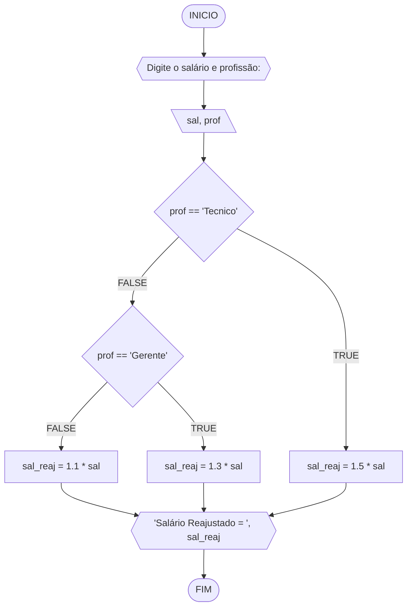
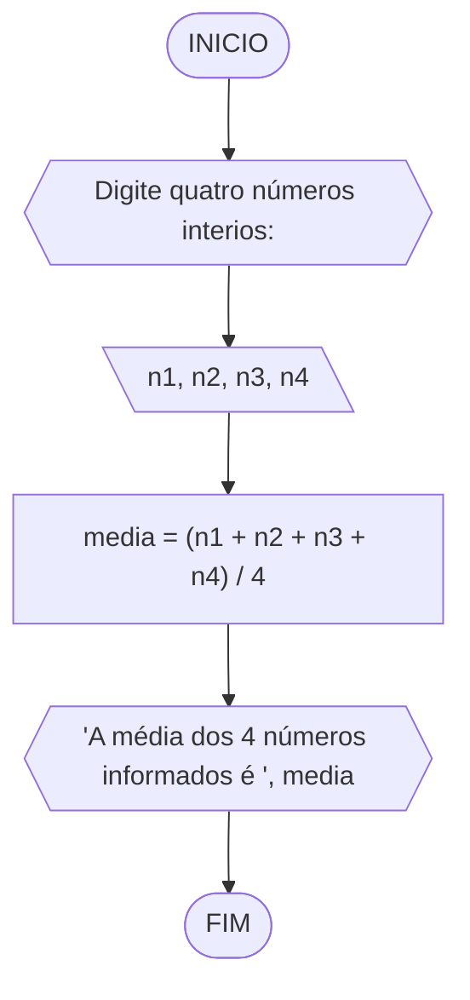
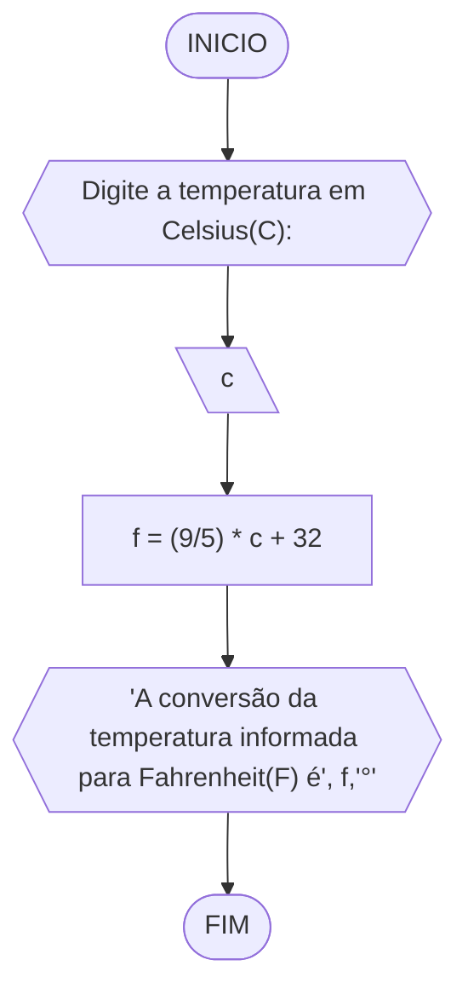
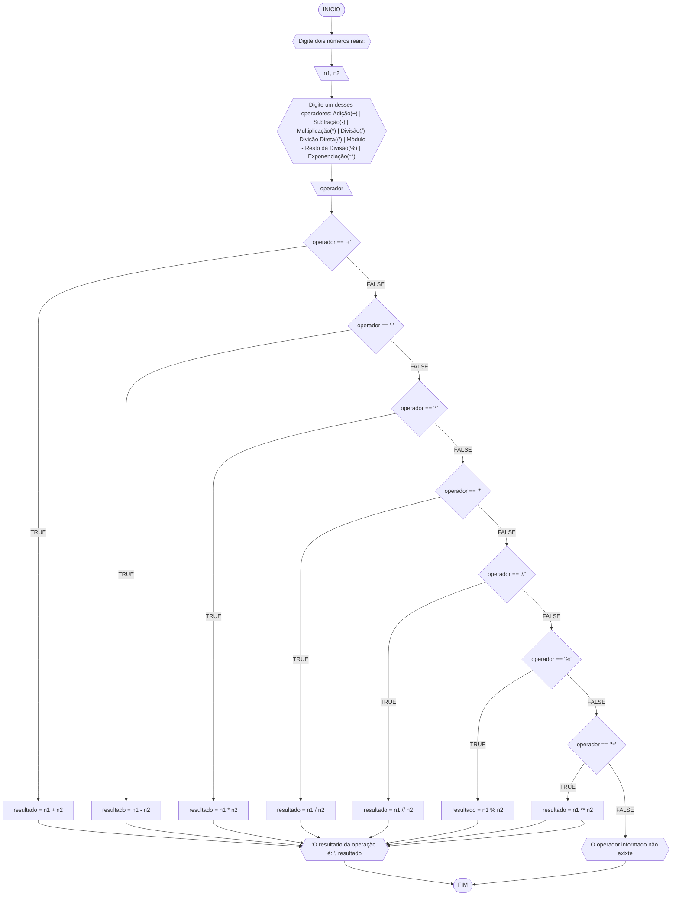
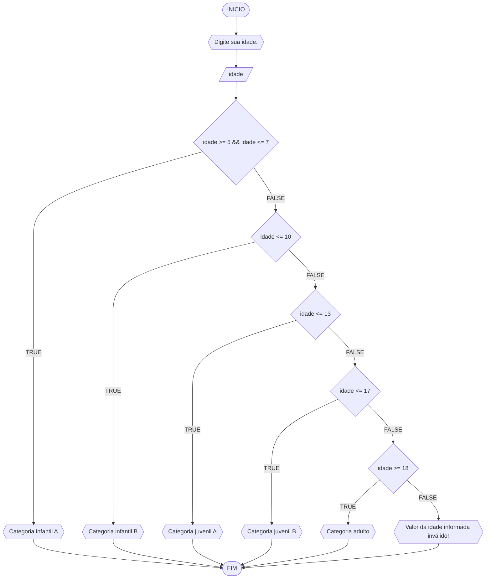

# UNIFOR
**Nome**: Maria Júlia Soares Siqueira Melo <br>
**Disciplina**: Raciocínio lógico algorítmico

## Exercício exemplo
Represente, em fluxograma e pseudocódigo, um algoritmo para calcular o adicional de salário de funcionário por cargo de uma empresa fictícia. Sabe-se que os funcionários de cargo técnico receberão reajuste de 50%, cargo de gerência, um reajuste de 30% e demais, um reajuste de 10%. 

#### Fluxograma


#### Pseudocódigo
```
1  ALGORITMO calReajuste
2  DECLARE  sal, sal_reaj: real, prof: caractere
3  INICIO
4  ESCREVA "Digite o salário e profissão:"
5  LEIA sal, prof
6  ESCOLHA
7   CASO prof == “Técnico”		
8     sal_reaj ← 1.5 * sal
9   CASO prof = “Gerente”		
10     sal_reaj ← 1.3 * sal
11  SENÃO
12    sal_reaj ← 1.1 * sal
13 FIM_ESCOLHA
14 ESCREVA “Salário Reajustado = “, sal_reaj
15 FIM_ALGORITMO
```

#### Teste
| sal | prof | prof == “Técnico” | prof = “Gerente” | sal_reaj | Saída |
| -- | -- | -- | -- | -- | -- |
| 1000 | Técnico | V | F | 1500 | “Salário Reajustado = 1500“ |
| 2000 | Gerente | F | V | 2600 | “Salário Reajustado = 2600“ |
| 9000 | Diretor | F | F | 9900 | “Salário Reajustado = 9900“ |

## Lista de exercícios 02

### Exercício 01 (2.5 pontos)
Calcule a média de quatro números inteiros dados.

#### Fluxograma (1.0 ponto)



#### Pseudocódigo (1.0 ponto)

```
1	Algoritmo media
2	DECLARE n1, n2, n3, n4: INTEIRO
3	INICIO
4	ESCREVA "Digite quatro números interios:"
5	LEIA n1, n2, n3, n4
6	media <- (n1 + n2 + n3 + n4) / 4
7	ESCREVA "A média dos 4 números informados é ", media
8 FIM_ALGORITMO
```

#### Teste de mesa (0.5 ponto)

| n1 | n2 | n3 | n4 | media | Saída |
|      --      |      --      |      --      |      --      |      --      |     --      | 
| 2 | 4 | -3 | -5 | -0.25 | "A média dos 4 números informados é 0.25" |
| 98 | 150 | -39 | 87 | 74 | "A média dos 4 números informados é 74" |
| 0 | 15000 | -658 | -888 | 3363.5 | "A média dos 4 números informados é 3363.5" |

### Exercício 02 (2.5 pontos)
Leia uma temperatura dada em Celsius (C) e imprima o equivalente em Fahrenheit (F). (Fórmula de conversão: F = (9/5) * C + 32)

#### Fluxograma (1.0 ponto)



#### Pseudocódigo (1.0 ponto)

```
1	Algoritmo converteCelsiusFarenheit
2	DECLARE c, f: REAL
3	INICIO
4	ESCREVA "Digite a temperatura em Celsius(C):"
5	LEIA c
6	f <- (9/5) * c + 32
7	ESCREVA 'A conversão da temperatura informada para Fahrenheit(F) é', f,'°'
8	FIM_ALGORITMO
```

#### Teste de mesa (0.5 ponto)

| c | f | Saída | 
|      --      |      --      |      --      | 
| 20 | 68 | 'A conversão da temperatura informada para Fahrenheit(F) é 68°' |
| -12.5 | 9.5 | 'A conversão da temperatura informada para Fahrenheit(F) é 9.5°' |
| 0 | 32 | 'A conversão da temperatura informada para Fahrenheit(F) é 32°' |

### Exercício 03 (2.5 pontos)
Receba dois números reais e um operador e efetue a operação correspondente com os valores recebidos (operandos). 
O algoritmo deve retornar o resultado da operação selecionada simulando todas as operações de uma calculadora simples.

#### Fluxograma (1.0 ponto)



#### Pseudocódigo (1.0 ponto)

```
1	Algoritmo calculadora
2	DECLARE n1, n2, resultado: REAL, operador: CARACTERE
3	INICIO
4	ESCREVA "Digite dois números reais:"
5	LEIA n1, n2
6	ESCREVA "Digite um desses operadores: Adição(+) | Subtração(-) | Multiplicação(*) | Divisão(/) | Divisão Direta(//) | Módulo - Resto da Divisão(%) | Exponenciação(**)"
7	LEIA operador
8	ESCOLHA
9		CASO operador == '+'
10			resultado <- n1 + n2
11		CASO operador == '-'
12			resultado <- n1 - n2
13		CASO operador == '*'
14			resultado <- n1 * n2
15		CASO operador == '/'
16			resultado <- n1 / n2
17		CASO operador == '//'
18			resultado <- n1 // n2
19		CASO operador == '%'
20			resultado <- n1 % n2
21		CASO operador == '**'
22			resultado <- n1 ** n2
23		SENAO
24			ESCREVA "O operador informado não exixte"
25	FIM_ESCOLHA
26	ESCREVA 'O resultado da operação é: ', resultado
27	FIM_ALGORITMO
```

#### Teste de mesa (0.5 ponto)

| n1 | n2 | operador | resultado | Saída | 
|      --      |      --      |      --      |      --      |      --      | 
| 6 | -8.5 | + | -2.5 | "O resultado da operação é: -2.5" |
| 89.658 | 32 | - | 57.658 | "O resultado da operação é: 57.658" |
| 10 | -3.5 | * | -35 | "O resultado da operação é: -35" |
| 89 | 75 | / | 1.1866666667 | "O resultado da operação é: 1.1866666667" |
| 89 | 75 | // | 1 | "O resultado da operação é: 1" |
| 8 | 5 | % | 3 | "O resultado da operação é: 3" |
| 7 | 3 | ** | 343 | "O resultado da operação é: 343" |
| 3 | 4 | ! |  | "O operador informado não exixte" |

### Exercício 04 (2.5 pontos)
Elaborar um algoritmo que, dada a idade, classifique nas categorias: infantil A (5 - 7 anos), infantil B (8 -10 anos), juvenil A (11 - 13 anos), juvenil B (14 -17 anos) e adulto (maiores que 18 anos).

#### Fluxograma (1.0 ponto)



#### Pseudocódigo (1.0 ponto)

```
1	Algoritmo classificaCategoria
2	DECLARE idade: INTEIRO
3	INICIO
4	ESCREVA "Digite sua idade: "
5	LEIA idade
6	ESCOLHA
7		CASO idade >= 5 && idade <= 7
8			ESCREVA "Categoria infantil A"
9		CASO idade <= 10
10			ESCREVA "Categoria infantil B"
11		CASO idade <= 13
12			ESCREVA "Categoria juvenil A"
13		CASO idade <= 17
14			ESCREVA "Categoria juvenil B"
15		CASO idade >= 18
16			ESCREVA "Categoria adulto"
17		SENAO
18			ESCREVA "Valor da idade informada inválido!"
19	FIM_ESCOLHA
20	FIM_ALGORITMO
```

#### Teste de mesa (0.5 ponto)

| idade | idade >= 5 && idade <= 7 | idade <= 10 | idade <= 13 | idade <= 17 | idade >= 18 | Saída |
|      --      |      --      |      --      |      --      |      --      |      --      |      --      |
| 4 | F | F | F | F | F | "Valor da idade informada inválido!" |
| 6 | V | F | F | F | F | "Categoria infantil A" |
| 8 | F | V | F | F | F | "Categoria infantil B" |
| 12 | F | F | V | F | F | "Categoria juvenil A" |
| 15 | F | F | F | V | F | "Categoria juvenil B" |
| 19 | F | F | F | F | V | "Categoria adulto" |
| -68 | F | F | F | F | F | "Valor da idade informada inválido!" |
