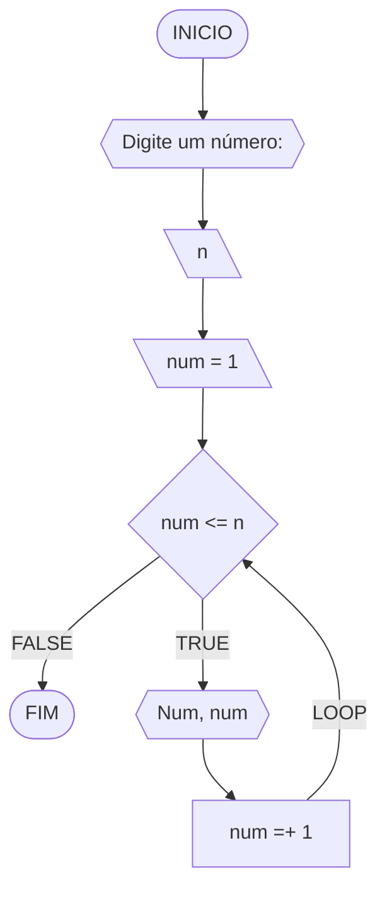
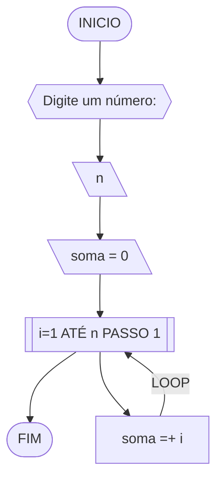
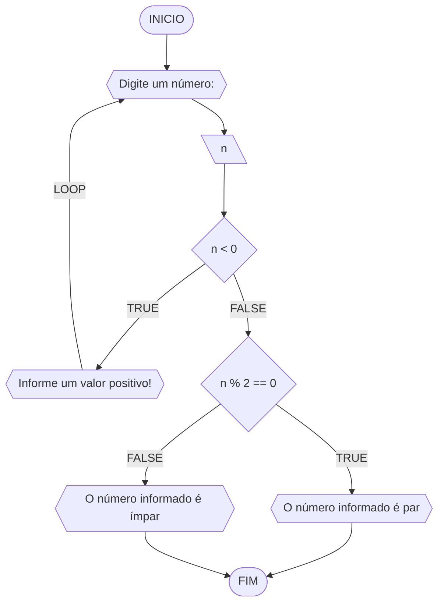
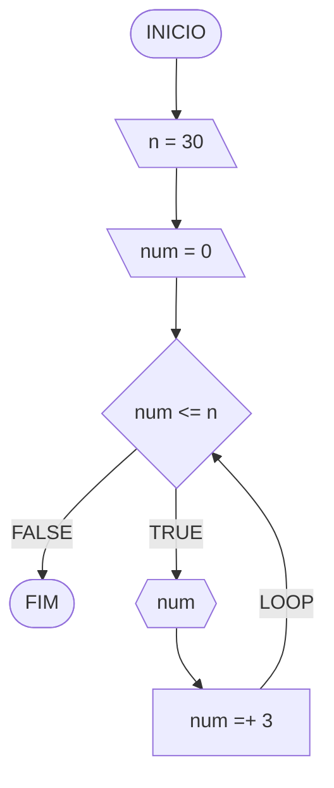
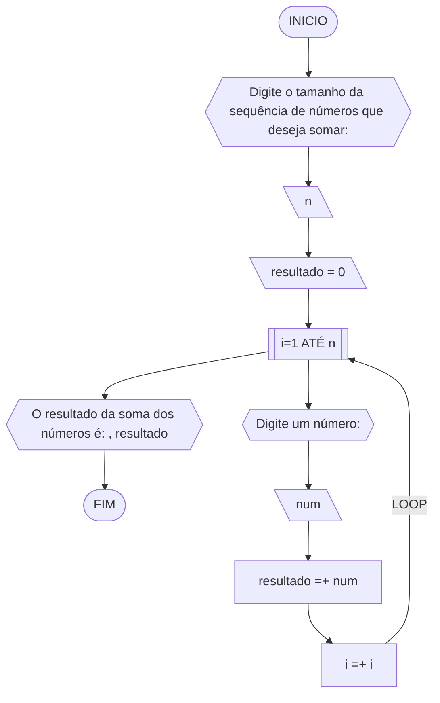
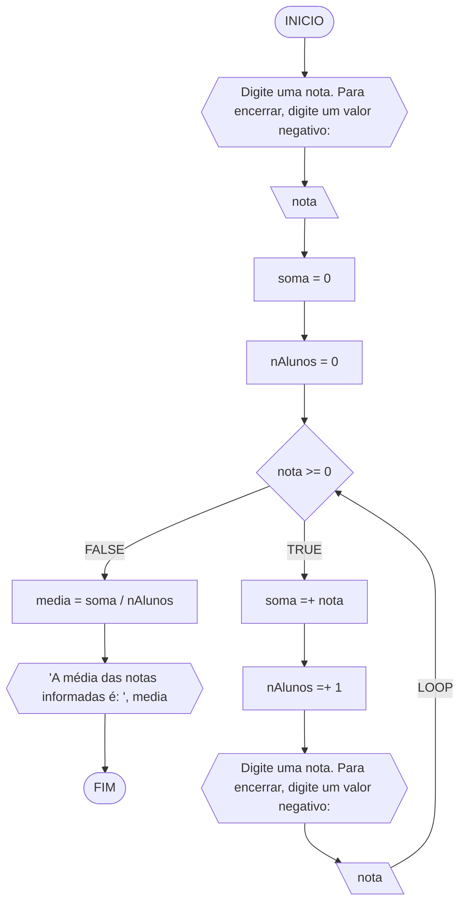

# UNIFOR
**Nome**: Maria Júlia Soares Siqueira Melo <br>
**Disciplina**: Raciocínio lógico algorítmico

## Exercício exemplo 1
Implemente e teste um programa que imprima os n primeiros números.

#### Fluxograma


#### Pseudocódigo
```
1 ALGORITMO print_n_primeiros
2 DECLARE n, num: INTEIRO
3 INICIO
4 ESCREVA “Digite um número: ”
4 LEIA n			// variável de entrada n
4 num ← 1			// variável num inicializada
5 ENQUANTO num <= n FAÇA	// n iterações
7	ESCREVA “Número ”, num
8	num ← num + 1		// num =+ 1 (incremento)
8 FIM_ENQUANTO
9 FIM
```

#### Teste de mesa
| it | n  | num | num <= n | Saída      | num =+ 1 |
| -- | -- | --  | --       | --         | --       |
| 1  | 10 | 1   | True     | Número 1   | 2        |
| 2  | 10 | 2   | True     | Número 2   | 3        |
| 3  | 10 | 3   | True     | Número 3   | 4        |
| 4  | 10 | 4   | True     | Número 4   | 5        |
| 5  | 10 | 5   | True     | Número 5   | 6        |
| 6  | 10 | 6   | True     | Número 6   | 7        |
| 7  | 10 | 7   | True     | Número 7   | 8        |
| 8  | 10 | 8   | True     | Número 8   | 9        |
| 9  | 10 | 9   | True     | Número 9   | 10       |
| 10 | 10 | 11  | True     | Número 10  | 11       |
| 11 | 10 | 11  | False    |            |          |

## Exercício exemplo 2
Implemente e teste um programa que some os n primeiros números.

#### Fluxograma


#### Pseudocódigo
```
1  ALGORITMO	soma_n_numeros()
2  DECLARE	n, i, soma: INTEIRO
3  INICIO
4  ESCREVA “Digite a quantidade de números: ”
5  LEIA n		// variável de entrada n
7  soma ← 0		// variável soma inicializada
6  PARA i DE 1 ATÉ n PASSO 1 FAÇA
7	soma ← soma + i	// soma =+ i (incremento)
8  FIM_PARA
9  ESCREVA “A soma é igual a ”, soma
10 FIM
```

#### Teste de mesa
| it | n  | soma | i  | soma =+ i |
| -- | -- | --   | -- | --        |
| 1  | 10 | 0    | 1  | 1         |
| 2  | 10 | 1    | 2  | 3         |
| 3  | 10 | 3    | 3  | 6         |
| 4  | 10 | 6    | 4  | 10        |
| 5  | 10 | 10   | 5  | 15        |
| 6  | 10 | 15   | 6  | 21        |
| 7  | 10 | 21   | 7  | 28        |
| 8  | 10 | 28   | 8  | 36        |
| 9  | 10 | 36   | 9  | 45        |
| 10 | 10 | 45   | 10 | 55        | 

## Lista de exercícios 03

### Exercício 01 (2.5 pontos)
Atualize o algoritmo para determinar se um número inteiro e positivo é par ou ímpar, usando uma laço condicional para aceitar apenas números maiores ou iguais a zero. 

#### Fluxograma (1.0 ponto)


#### Pseudocódigo (1.0 ponto)

```
1	Algoritmo verificar_par_impar
2	DECLARE n: INTEIRO
3	INICIO
4	ESCREVA "Digite um número: "
5	LEIA n
6	ENQUANTO n < 0 FAÇA
7		ESCREVA "Informe um valor positivo!"
8		ESCREVA "Digite um número: "
9	FIM_ENQUANTO
10	SE n % 2 == 0 ENTAO
11		ESCREVA "O número informado é par"
12	SENAO
13		ESCREVA "O número informado é ímpar"
14	FIM_SE
15	FIM_ALGORITMO
```
#### Teste de mesa (0.5 ponto)

| n | n < 0 | n % 2 == 0 | Saída |
|      --      |      --      |      --      |      --      |
| -9 | True |  | "Informe um valor positivo!" <br> "Digite um número: " |
| 3 | False | False | "O número informado é ímpar" |
| 8 | False | True | "O número informado é par" |

### Exercício 02 (2.5 pontos)
Faça um algoritmo que exiba na tela uma contagem de 0 até 30, exibindo apenas os múltiplos de 3.

#### Fluxograma (1.0 ponto)


#### Pseudocódigo (1.0 ponto)

```
1	Algoritmo contagem_0_a_30
2	DECLARE n, num: INTEIRO
3	INICIO
4	n <- 30
5	num <- 0
6	ENQUANTO num <= n FAÇA
7		ESCREVA num
8		num <- num + 3	
9	FIM_ENQUANTO
10	FIM_ALGORITMO
```
#### Teste de mesa (0.5 ponto)

| it | n | num | num <= n | Saída | num =+ 3 |
|      --      |      --      |      --      |      --      |      --      |      --      | 
| 1 | 30 | 0 | True | 0 | 3 |
| 2 | 30 | 3 | True | 3 | 6 |
| 3 | 30 | 6 | True | 6 | 9 |
| 4 | 30 | 9 | True | 9 | 12 |
| 5 | 30 | 12 | True | 12 | 15 |
| 6 | 30 | 15 | True | 15 | 18 |
| 7 | 30 | 18 | True | 18 |21 |
| 8 | 30 | 21 | True | 21 | 24 |
| 9 | 30 | 24 | True | 24 | 27 |
| 10 | 30 | 27 | True | 27 | 30 |
| 10 | 30 | 30 | True | 30 | 33 |
| 10 | 33 | 33 | False |  |  |

### Exercício 03 (2.5 pontos)
Dada uma sequência de números inteiros, calcular a sua soma. 
Por exemplo, para a sequência {12, 17, 4, -6, 8, 0}, o seu programa deve escrever o número 35.

#### Fluxograma (1.0 ponto)


#### Pseudocódigo (1.0 ponto)

```
1	Algoritmo soma_sequencia
2	DECLARE n, i: INTEIRO, resultado, num: REAL
3	INICIO
4	ESCREVA "Digite o tamanho da sequência de números que deseja somar: "
5	LEIA n
6	resultado <- 0
7	PARA i DE 1 ATÉ n FAÇA
8		ESCREVA "Digite um número: "
9		LEIA num
10		resultado <- resultado + num
11		i <- i + 1
12	FIM_PARA
13	ESCREVA "O resultado da soma dos números é: ", resultado
14	FIM_ALGORITMO
```
#### Teste de mesa (0.5 ponto)

| it | n  | num | i  | resultado =+ num |
| -- | -- | --   | -- | -- |
| 1  | 5 | 3 | 1 | 3 |
| 2  | 5 | 7 | 2 | 10 |
| 3  | 5 | 12.65 | 3 | 22.65 |
| 4  | 5 | -6 | 4 | 16.65 |
| 5  | 5 | 1.5 | 5 | 18.15 |

### Exercício 04 (2.5 pontos)
Escreva um programa que leia a nota de diversos alunos, até que seja digitada uma nota negativa. 
Nesse momento, ele mostra a média aritmética de todas as notas lidas e quantas notas foram lidas. 
Ex. Foram lidas 14 notas. A média aritmética é 6.75!

#### Fluxograma (1.0 ponto)



#### Pseudocódigo (1.0 ponto)

```
1	Algoritmo media_notas
2	DECLARE nota, soma, media: REAL, nAlunos: INTEIRO
3	INICIO
4	ESCREVA "Digite uma nota. Para encerrar, digite um valor negativo: "
5	LEIA nota
6	soma <- 0
7	nAlunos <- 0
8	ENQUANTO nota >= 0 FAÇA
9		soma <- soma + nota	
10		nAlunos <- nAlunos + 1		
11		ESCREVA "Digite uma nota. Para encerrar, digite um valor negativo:"
12		LEIA nota
13	FIM_ENQUANTO
14	media <- soma / nAlunos
15	ESCREVA "A média das notas informadas é: ", media
16	FIM_ALGORITMO
```

#### Teste de mesa (0.5 ponto)

| it | nota | soma | nAlunos | nota >= 0 | soma =+ nota | nAlunos =+ 1 | media = soma / nAlunos | Saída |
| -- | -- | --  | --       | --         | --       | --       | --       | --       |
| 1  | 10 | 0 | 0 | True | 10 | 1 |  |  |
| 2  | 8.6 | 10 | 1 | True | 18.6 | 2 |  |  |
| 3  | 6 | 18.6 | 2 | True | 24.6 | 3 |  |  |
| 4  | 9.4 | 24.6 | 3 | True | 34 | 4 |  |  |
| 5  | -1 | 34 | 4 | False |  |  | 8.5 | "A média das notas informadas é: 8.5" |
